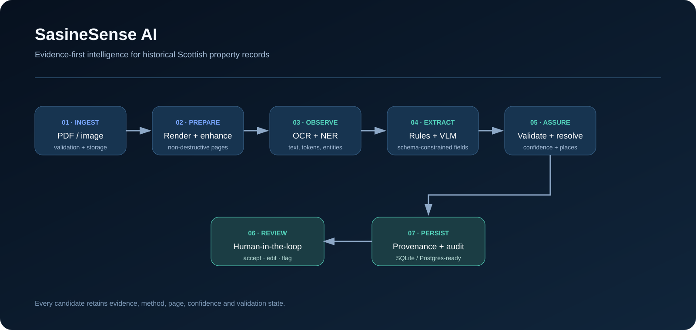
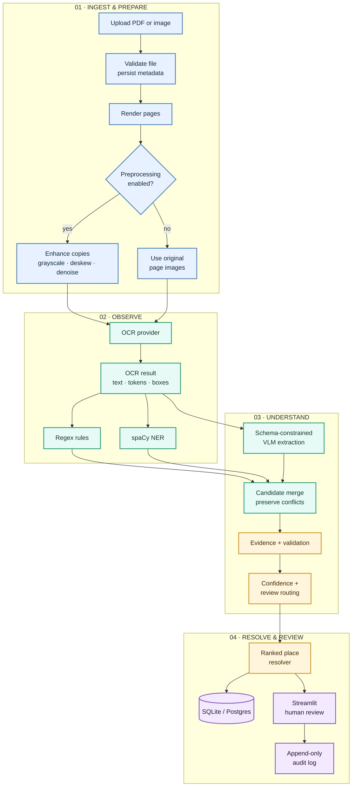
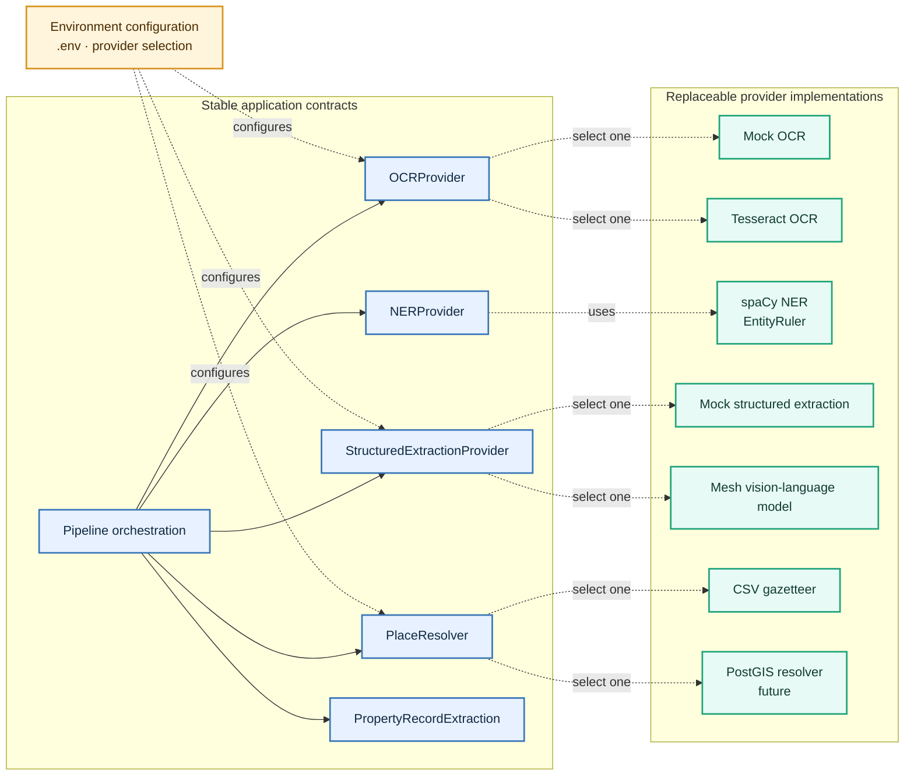
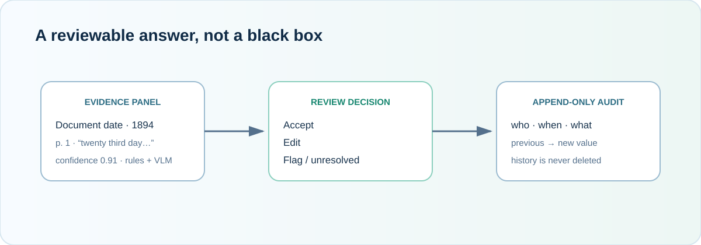

<div align="center">

# SasineSense AI

### Evidence-first document intelligence for historical Scottish property records

<p>
  
  
  
  
</p>

Scanned deeds, sasines, dispositions, title-related forms and maps are difficult to search, compare and validate. SasineSense AI combines deterministic extraction, NLP, OCR, vision-language models and human review into one provenance-preserving pipeline.

<p><a href="#quick-start">Quick start</a> · <a href="#architecture">Architecture</a> · <a href="#api">API</a> · <a href="#roadmap">Roadmap</a></p>

</div>

> **Safety notice:** This is a research demonstrator using public or synthetic documents. It is not an authoritative land-registration system and must not be used to make legal title decisions. Low-confidence and conflicting values are routed to a reviewer.



## Why this project

Historical property records mix inconsistent typography, archaic language, scanned images, handwritten notes and ambiguous place names. A single model can produce fluent but unsupported answers. SasineSense AI is designed around a different principle:

> **No extracted field should lose its evidence, method, confidence or validation state.**

The system keeps multiple candidates instead of silently overwriting conflicts, uses schema-constrained outputs, and gives experts a review surface with an append-only audit trail.

## What is implemented

| Capability | Implementation | Status |
| --- | --- | :---: |
| PDF/image ingestion and validation | FastAPI + PyMuPDF | ✅ |
| Page rendering and preprocessing | PyMuPDF + OpenCV/Pillow | ✅ |
| OCR adapter | Mock provider + Tesseract | ✅ |
| Deterministic extraction | Regex rules + document classifier | ✅ |
| Entity extraction | spaCy NER + EntityRuler | ✅ |
| Structured extraction | Mock provider + Mesh VLM adapter | ✅ |
| Candidate merge and provenance | Pydantic schemas | ✅ |
| Validation and confidence | Rule checks + review routing | ✅ |
| Place resolution | Ranked CSV gazetteer | ✅ |
| Human review | Streamlit reviewer | ✅ |
| Durable storage | SQLAlchemy, SQLite/Postgres-ready | ✅ |
| Evaluation | Field-level metrics and baseline report | ✅ |
| Bounded agents | Permissioned Triage/Verification/Consistency/Geo | ⏳ |

## Architecture

### End-to-end flow



### Provider boundaries



The pipeline depends on interfaces rather than concrete vendors. Local/mock providers are the safe default; real providers can be enabled through environment variables without changing business logic.

### Human review loop



The reviewer can accept, edit, flag or mark a field unresolved. Each action records the document, field, previous value, new value, timestamp and note; history is never mutated in place.

## Structured output

Every field is represented as an evidence-bearing candidate. A simplified example:

```json
{
  "name": "property_location",
  "value": "Glasgow",
  "normalized_value": "Glasgow",
  "confidence": 0.93,
  "method": "regex+ner+vlm",
  "evidence": [{"page": 1, "text": "lands situated in Glasgow"}],
  "validation": {"status": "passed", "rules": ["non_empty", "place_resolved"]}
}
```

The top-level extraction includes document type/date, parties, property description, places, rights, burdens, servitudes, title references, map references, source pages, review state and metadata about every provider used.

## Quick start

### Install

```bash
git clone https://github.com/nitesh0007-edith/SasineSenseAI.git
cd SasineSenseAI
python -m venv .venv
source .venv/bin/activate       # Windows: .venv\Scripts\activate
python -m pip install -r requirements.txt
python -m spacy download en_core_web_sm
cp .env.example .env
```

### Run the API and reviewer

Terminal 1:

```bash
uvicorn app.api.main:app --reload
```

Terminal 2:

```bash
streamlit run app/ui/reviewer.py
```

Open `http://localhost:8501`, upload a PDF/image, and select **Run extraction**.

### Run quality checks

```bash
python -m pytest -q
python -m ruff check .
```

Current baseline: **82 tests passed, 1 skipped** and Ruff clean. The skipped test covers graceful behavior when the optional system Tesseract binary is unavailable.

## Configuration

Providers are selected in `.env`:

```dotenv
OCR_PROVIDER=mock                         # mock | tesseract
NER_PROVIDER=spacy
STRUCTURED_EXTRACTION_PROVIDER=mock       # mock | mesh
PREPROCESS_ENABLED=false
DATABASE_URL=sqlite:///./data/derived/app.db
```

For real OCR, install Tesseract (`brew install tesseract` or `apt install tesseract-ocr`) and set `OCR_PROVIDER=tesseract`.

For real VLM extraction, set `STRUCTURED_EXTRACTION_PROVIDER=mesh` and provide a Mesh API key in a local, unsynced `.env`. Never commit credentials. The adapter sends OCR text plus page images, requests schema-constrained JSON, retries malformed JSON once, and uses `null` when uncertain.

## API

| Method | Endpoint | Purpose |
| :---: | --- | --- |
| `GET` | `/health` | Service health check |
| `POST` | `/documents` | Upload a PDF or image |
| `POST` | `/documents/{id}/extract` | Run the extraction pipeline |
| `POST` | `/documents/{id}/reviews` | Append a reviewer action |
| `GET` | `/documents/{id}/reviews` | Read review history |

Interactive OpenAPI documentation is available at `http://localhost:8000/docs` while the API is running.

## Evaluation

The evaluation harness compares the baseline ladder on labelled data:

1. OCR + regex
2. OCR + mock VLM
3. OCR + real VLM (optional)

```bash
python -m app.eval.run
MESH_API_KEY=... python -m app.eval.run --live
```

Reports are written to `data/derived/eval/baseline_comparison.csv` and `.md`. The checked-in example corpus is intentionally synthetic; a real annotated corpus is required for research-grade conclusions.

## Repository layout

```text
app/
├── api/          FastAPI endpoints
├── core/         settings and configuration
├── db/           SQLAlchemy models and repository
├── eval/         metrics, harness and baseline runner
├── providers/    OCR, NER, VLM and place-resolver adapters
├── services/     ingestion, rendering, pipeline, merge, validation and review
└── ui/           Streamlit reviewer
data/             sample annotations and gazetteer fixtures
docs/             research plan, annotation guide and architecture visuals
tests/            unit and integration tests
```

## Roadmap

- [ ] Phase 12: bounded, permissioned agents for triage, verification, consistency and geo resolution.
- [ ] Replace the two-document synthetic corpus with real annotated public records.
- [ ] Expand the gazetteer and add a PostGIS-backed resolver with ranked candidates.
- [ ] Add Alembic migrations as persistence evolves.
- [ ] Feed spaCy PERSON/GPE candidates into the final merge path.
- [ ] Add CI, containerized API/UI deployment and observability.

## Research and safety notes

- See [`docs/RESEARCH_PLAN.md`](docs/RESEARCH_PLAN.md) for hypotheses and evaluation design.
- See [`docs/ANNOTATION_GUIDE.md`](docs/ANNOTATION_GUIDE.md) for gold-label conventions.
- See [`CODEX_TASKS.md`](CODEX_TASKS.md) for the incremental implementation plan.
- Do not upload confidential or copyrighted records without the necessary rights.
- Do not treat generated output as legal advice or proof of ownership.
- Keep secrets in a local `.env`; `.gitignore` excludes credentials, uploads, derived data and databases.

## License

No production license has been declared yet. Treat this repository as a research prototype until a license and contribution policy are added.

<div align="center">Built for careful, explainable exploration of historical property records.</div>
